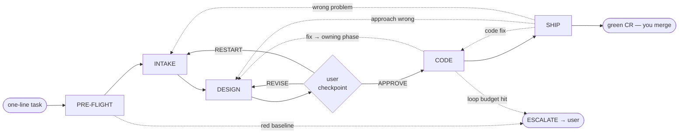
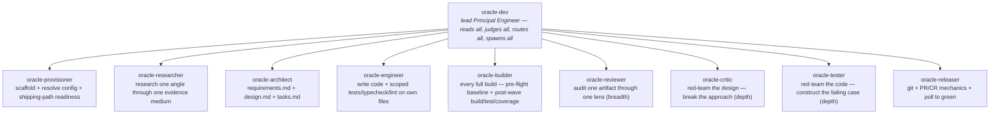

# Oracle

An autonomous principal-engineer coding pipeline for Claude Code. Give it a one-line task; it researches the problem exhaustively, designs the change, implements it under adversarial review, and ships one PR/CR for the workspace — thorough enough that a human can review it on sight and merge to production.

```
/oracle add retry with exponential backoff to the API client
```

## The idea

Treat every sub-agent as a Principal Engineer in a single specialty, and the orchestrator as the lead Principal Engineer who holds the whole system in view. The orchestrator decomposes the problem, routes work to the right principal, reads everything they produce, spawns adversarial reviewers to attack it, and only advances when the work would survive the harshest reviewer downstream. The output isn't "code that compiles" — it's a change request so complete and so well-defended that approval is the obvious decision.

## Pipeline



Root-cause routing drives iteration: each finding is sent back to the phase that owns its cause, bounded by the loop budgets in [context/quality-gates.md](context/quality-gates.md); a loop that can't converge `ESCALATE`s to you rather than churning.

| Phase | What happens |
|---|---|
| **PRE-FLIGHT** | `oracle-provisioner` mints a task-id, scaffolds the run, and resolves config (auto-detect build/test/branch, confirm a review path); then `oracle-builder` gates the **baseline build** of the untouched tree. A misconfigured setup or a red baseline escalates before any work begins. |
| **INTAKE** | A research loop that exhausts investigation before asking you anything. Decomposes the task into angles, fans out specialist investigators (one question, one evidence medium each, including a negation angle), and synthesizes `intake.md`. Most tasks → zero questions. |
| **DESIGN** | `oracle-architect` produces `requirements.md` (testable outcomes), `design.md` (architecture, alternatives, risks, rollback, blast radius), and `tasks.md` (an execution DAG of coherent-unit tasks across the workspace) — audited by a reviewer and attacked by `oracle-critic`. **One user checkpoint:** `APPROVE` / `APPROVE WITH CHANGES` / `REVISE` (rework the design) / `RESTART` (new framing, back to INTAKE). |
| **CODE** | Executes the task DAG wave by wave, in parallel — each task is one coherent unit of work (a module or logical change spanning its related files), one engineer per task. Engineers write and run *scoped* checks on their own files; `oracle-builder` then runs the authoritative full build + test suite + coverage per wave; reviewers audit and `oracle-tester` attacks. Findings route to the phase that owns the fix. |
| **SHIP** | The orchestrator authors the commit message and PR/CR description; `oracle-releaser` commits, pushes one CR for the workspace against the main branch, opens a draft review, and polls to terminal-green. A change spanning several packages of the workspace (built in dependency order) lands in that single CR. **Never auto-merges.** |

After APPROVE, the run is autonomous to terminal-green; the only further interruption is an escalation it genuinely can't resolve alone.

## Architecture — flat, one spawner

Only the orchestrator (`oracle-dev`) spawns. Every other agent is a leaf that does its job and returns. This keeps the spawn tree shallow, the routing centralized, and the judgment in one place.



The orchestrator authors the commit message and PR/CR description itself — it holds the full pipeline context, so that text is its work, not a sub-agent's.

The judgment-bearing agents inherit the session model (Opus); the three purely-mechanical ones — `oracle-provisioner`, `oracle-builder`, `oracle-releaser` — pin Sonnet, since scaffolding, building, and git mechanics need no Opus-level reasoning. No agent declares `tools:`; capability boundaries (only `oracle-dev` spawns, only `oracle-engineer` writes source) are enforced by prose contract, not withheld access.

## Durable artifact bus

Agents communicate through disk, not just conversation. Specs land in `~/.oracle/specs/<task-id>/`; runtime state, evidence, and per-phase verdicts in `~/.oracle/runs/<task-id>/`. This survives context compaction and session interruption (a run **resumes from the last verdict**), gives parallel agents a shared medium, and leaves a full audit trail — every claim traces to a cited artifact. None of it is ever part of a commit. See [context/artifact-bus.md](context/artifact-bus.md).

## Adversarial review — two modes

Scrutiny runs in two complementary modes, and both must pass before an artifact advances:

- **Audit (breadth)** — `oracle-reviewer` loads the review module for the artifact type it's given (`code`, `design`, `research`, or `verdict`) and applies that target's patterns in full. For code that's eight lenses — correctness, safety, performance, quality, compatibility, intent-fidelity, platform-compliance, clean-code — one reviewer per lens, each loading only the standards *its* lens validates (quality owns substance, clean-code owns layout). Every BLOCK carries a steel-manned counter-argument; every finding routes to the phase that owns the fix.
- **Debate (depth)** — a goal-driven adversary tries to *break* the work: `oracle-critic` attacks the design's assumptions, `oracle-tester` constructs the input/race/boundary that breaks the code. The producer proposes, the adversary attacks, the orchestrator judges, and the loop repeats until the adversary can't land a grounded hit (`context/doctrine/adversarial-debate.md`).

The orchestrator judges its own gate decisions too: on a consequential verdict it records a rationale and a `verdict`-target reviewer audits it for bias and unjustified reversals — the one judge that nothing else checks. Ungrounded findings are advisory, not auto-actioned, and a passing state is never reversed on argument alone. See [context/review/](context/review/) and [context/doctrine/adversarial-debate.md](context/doctrine/adversarial-debate.md).

## Opinionated standards

Seventeen standards set the bar the engineer writes to and the quality/clean-code lenses enforce: functions ≤20 lines and ≤1 nesting level, no `else` blocks or ternaries, no force-unwraps or `any`, errors handled at the boundary via a `safeRun`/`Result` idiom, illegal states made unrepresentable, classes with one responsibility composed over inheritance, AAA tests with property-based tests for pure functions, and ≥80% modified-line coverage. The cross-cutting value is **simplicity — the Go ethos applied to every language in its own idiom**: clarity over cleverness, explicit over implicit, errors as values, composition over inheritance, the simplest thing that works ([context/principles.md](context/principles.md)). Each standard is **MUST** for safety/correctness and **SHOULD** with a documented escape hatch for taste, and they're **loaded by relevance** — a core set always, the rest only when a change touches their surface ([context/coding-standards/_index.md](context/coding-standards/_index.md)). A project can override any of it. See [context/coding-standards/](context/coding-standards/).

## Configuration — zero internal knowledge, fully customizable

The plugin ships with **no organization-specific knowledge**. The committed default ([context/config.json](context/config.json)) is entirely public: `gh` CLI, generic build/test detection, public web research. To adapt it to your environment — internal code-search MCP tools, a non-GitHub review/shipping path (your own `operations.pr` commands), tighter quality bars, extra off-limits paths — drop a `.oracle/config.json` in your project root. It deep-merges over the default and wins on every key it sets. See [context/config.schema.md](context/config.schema.md).

```jsonc
// <your-project>/.oracle/config.json
{
  "operations": { "pr": { "create": "<your-review-cli> create --draft", "status": "<your-review-cli> status --json", "ready": "<your-review-cli> publish", "comment": "<your-review-cli> comment" } },
  "research": { "code": { "tools": ["Read", "Grep", "Glob", "Bash", "mcp__your-code-search__Query"] } },
  "thresholds": { "review_fanout_floor": 6 }
}
```

## Usage

Full pipeline:
```
/oracle migrate the session store from Redis to DynamoDB across the api and worker packages
```

Direct mode — skip research and design for a mechanical change (the review gate still applies):
```
/oracle just rename getUserName to getUsername in src/user.ts
```

### Recommended runtime settings

Oracle is a long-horizon agentic system, so run it where the model has room to reason and act:

- **Effort: `xhigh`** (or `high` minimum). Per Anthropic's guidance, `xhigh` is the best setting for coding and agentic work; lower settings scope work narrowly and risk under-thinking on the multi-step reasoning Oracle depends on.
- **Large max-output budget** — start around 64k tokens so the orchestrator has room to think and drive its sub-agents across a long run.
- **Specify the task fully in the first turn.** Oracle is autonomous after the design checkpoint; a well-specified initial ask maximizes both quality and token efficiency. Ambiguity spread over many follow-up turns costs more and helps less.

### Permissions (required)

Oracle's sub-agents run **headless** — they cannot answer a permission prompt mid-task — and they write the durable artifact bus to **`$HOME/.oracle/`** (outside your project) and run the bundled `bin/` scripts. A Claude Code plugin **cannot grant its own permissions** (that is always the user's `settings.json`), so if these scopes aren't pre-approved, a sub-agent's `Write` to `~/.oracle/` is auto-denied and the run fails with a bare "Write failed". Add the following to your user `~/.claude/settings.json` (or project `.claude/settings.json`) — replace `<YOU>` with your home-dir username:

```jsonc
{
  "permissions": {
    "defaultMode": "acceptEdits",
    "allow": [
      "Write(//Users/<YOU>/.oracle/**)",
      "Read(//Users/<YOU>/.oracle/**)",
      "Bash(bin/oracle-allocate-output:*)",
      "Bash(bin/oracle-manifest-append:*)",
      "Bash(gh pr *)",
      "Bash(git commit *)",
      "Bash(git push *)"
    ],
    "additionalDirectories": ["/Users/<YOU>/.oracle"]
  }
}
```

- `acceptEdits` lets the wave of parallel sub-agents write artifacts and edit source without a prompt per file; Bash still prompts for anything outside the allow-list, so you keep oversight of what runs.
- For a **fully non-interactive / CI** run, use `"defaultMode": "dontAsk"` instead and add the exact build/test/review commands your project uses (e.g. `Bash(npm run *)`) to `allow` — `dontAsk` executes only what's listed and denies the rest, with zero prompts.
- Your *project's* own build/test/lint commands (resolved into `config.resolved.json`) also run through Bash; allow them too, or run in a mode that permits them.

## Installation

Oracle is a self-contained Claude Code plugin with its own one-plugin marketplace ([.claude-plugin/marketplace.json](.claude-plugin/marketplace.json)). Register the marketplace, then install:

```bash
# from a local clone
claude plugin marketplace add /path/to/oracle
claude plugin install oracle@oracle            # --scope user (default) | project | local

# or straight from GitHub
claude plugin marketplace add KarthikMAM/oracle
claude plugin install oracle@oracle
```

Verify with `claude plugin details oracle@oracle` — you should see the `/oracle` command and ten agents discovered, zero hooks. Components are auto-discovered: the `/oracle` command from [commands/](commands/), the ten agents from [agents/](agents/) (the orchestrator plus nine specialists), and the reference material in [context/](context/) that agents read by relative path. The plumbing scripts in [bin/](bin/) back the durable artifact bus. Update after pulling changes with `claude plugin marketplace update oracle`.

## License

MIT
